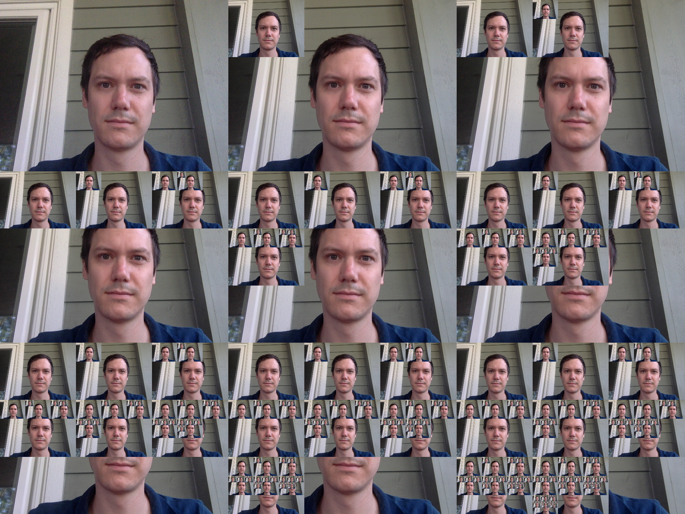

# Activity 1 - Algorithms

This activity is designed to accompany the Art Canada Institute Teacher Resource Guide titled *Understanding Computer Science Through the Art of Michael Snow*.

In this directory you will find a file written for the [Processing](https://processing.org) development environment, written in Java. This file uses a webcam to re-imagine the process used in the artwork *Authorization*, Michael Snow, 1969. Please see the attached images for an example output along with a final image that has been combined to directly mirror the artwork of Michael Snow.

