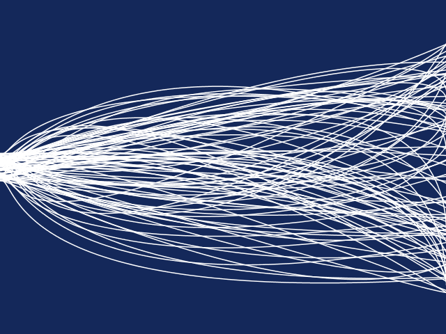

# Activity 2 - Loops
This activity is designed to accompany the Art Canada Institute Teacher Resource Guide titled *Understanding Computer Science Through the Art of Michael Snow*.

In this directory you will find a file written for the [Processing](https://processing.org) development environment, written in Java. This file uses loops to create a complex abstract image. Please see the attached an example outputthat has been inspired by the artwork of Michael Snow to use as an exemplar for students.

